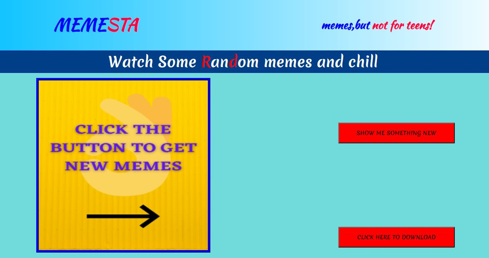
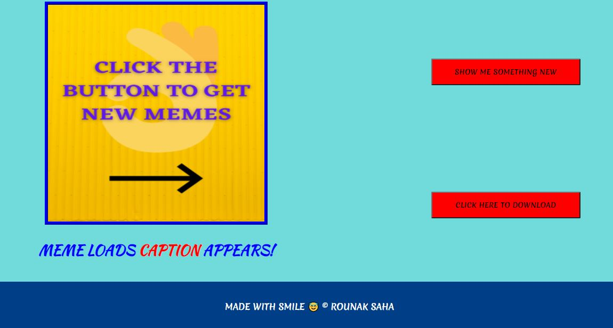

# MEME_WEBSITE
 MEME_WEBSITE : This website will show you fresh and random memes with a simple click , an effortless way of spending some casual time . 
 
### The website is deployed and you can check it out from the below given link:

[MEMESTAR](https://memestar.netlify.app/)

The API is given in the repository , you can use it to create other such fun projects.

***
### Below attached are the screenshots of the website in action.

The landing page:

> The first part of the landing page 

***

> The second half of the landing page

***

> The website after the meme is loaded.

***
***

>Do star the project if you liked it or even a single meme could make you giggle.

Mention any bugs or issues.
